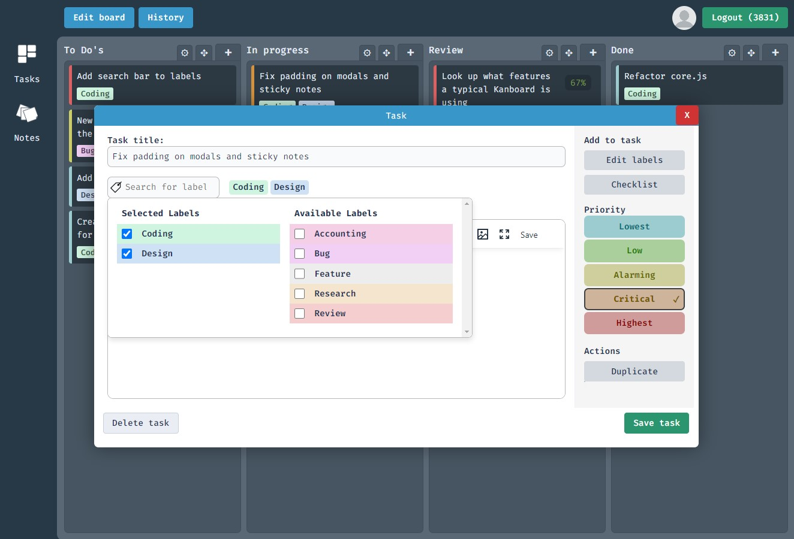
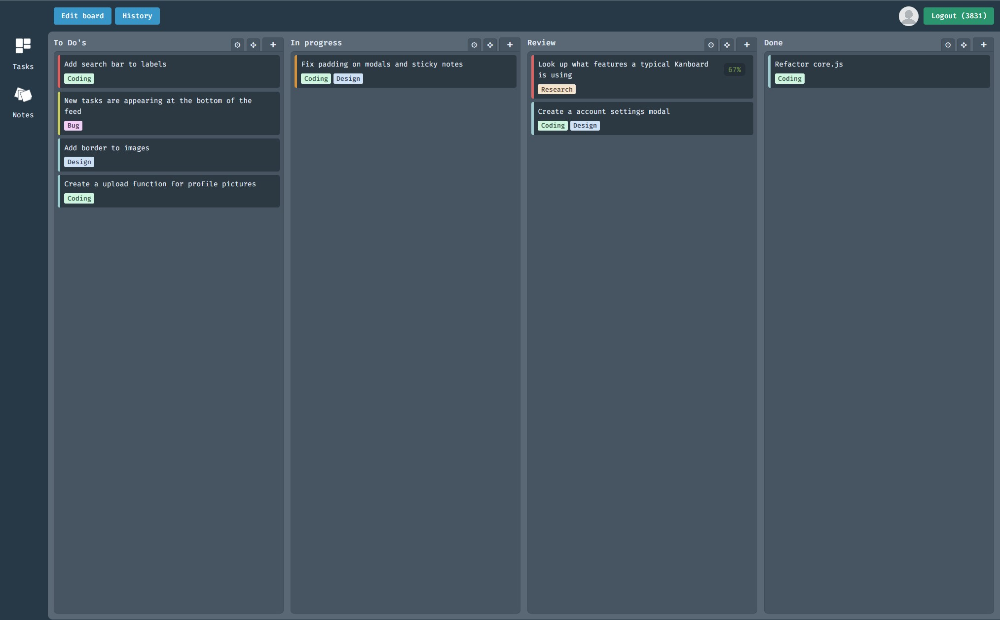
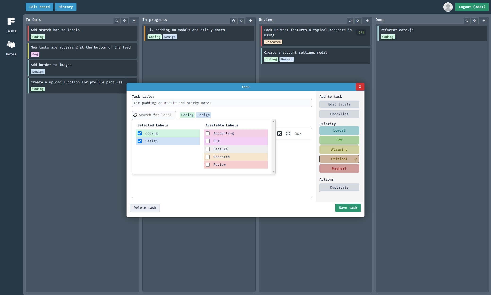
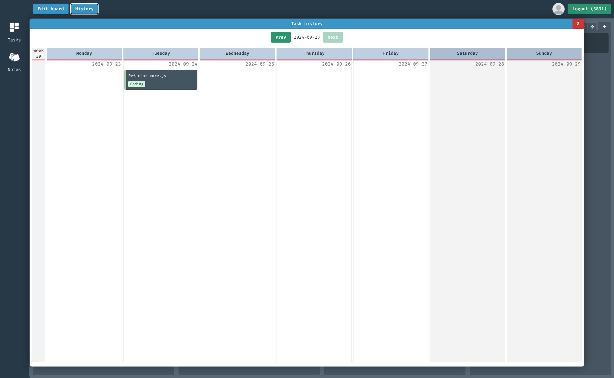
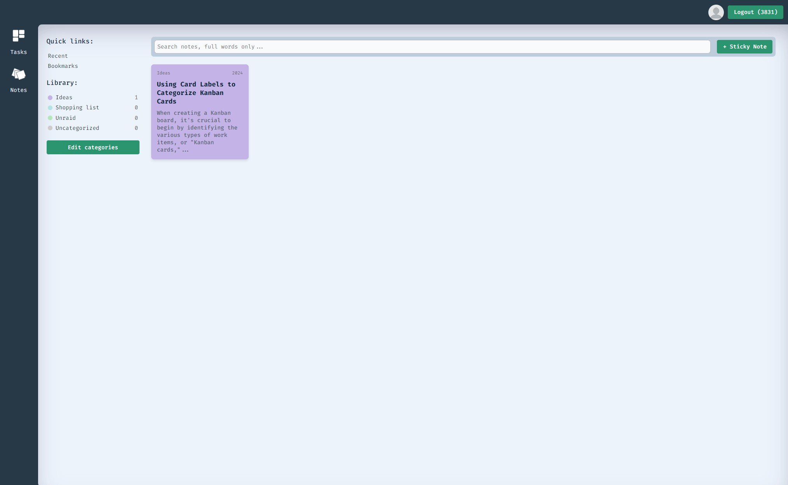
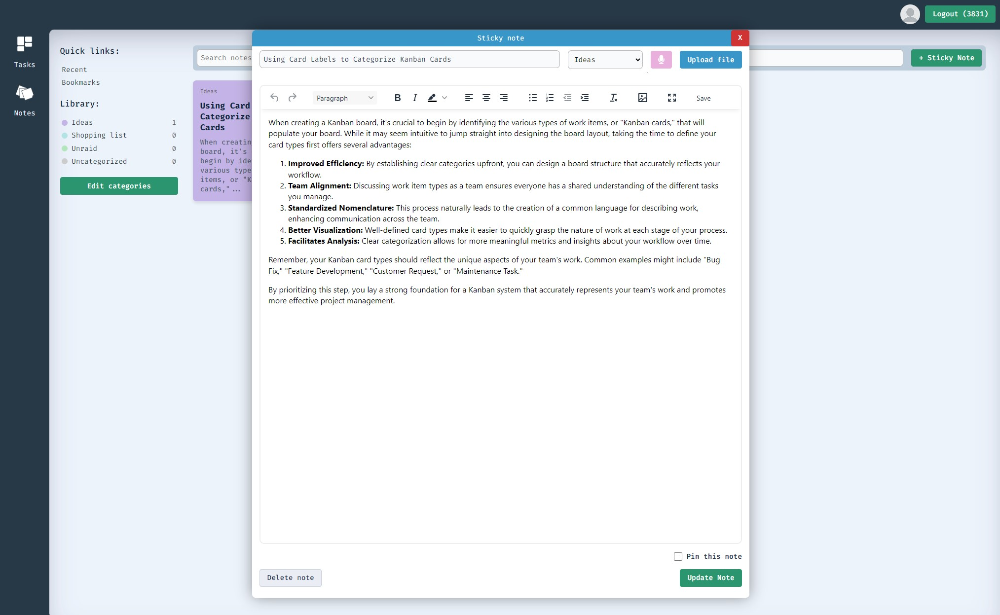

# Dashboard - A meaningful life with tasks



## Description
Dashboard for personal use. Task management and stickynotes. This project serves as my exploration into HTMX, combining practical utility with modern web development techniques.

Version 1.0.0
### Key features

- Task management
- Sticky notes
- Create sticky notes with voice-to-text transcription for easier note-taking. The app requires an OpenAI API key for speech recognition.
- TinyMCE integration for rich text editing
- Built with HTMX for dynamic content updates

While the core functionality is largely complete, I'm continuously working on expanding features and refining the user experience. This project showcases a personalized approach to productivity tools, tailored to individual workflow preferences.

## Installation
### Prerequisites

PHP (version 8.1 or higher)

Apache web server with mod_rewrite enabled

Npm

### Steps

**Clone the repository:**

    - Copygit clone https://github.com/MajorJohnDoe/dashboard.git

    - cd dashboard

**Install npm dependencies:**

    - npm install

**Configure your web server:**

    - Ensure that the document root is set to the project's public directory.

    - Make sure the .htaccess file is present in the root directory and that Apache is configured to allow .htaccess overrides.

**Set up your PHP environment:**

    - Rename config.example.php to config.php and update the configuration settings as needed. Database connection etc. Both MariaDB and MySQL should work.

**Database Setup:**

This project uses MariaDB. To set up the database and load test data:

1. Ensure you have MariaDB installed and running.
2. Open a terminal and connect to your MariaDB server.
3. Run the following command to create the database, tables, and insert test data:

   ```
   mysql -u your_username -p < path/to/database_setup.sql
   ```

This will create the necessary tables and insert some test data to get you started. Or just use PHPMyAdmin and import the sql-file into the database.


## Usage
Access the dashboard through your web browser by navigating to the configured domain or localhost address. You should be directed to a login page where you can login with **username: johndoe and password: password**.

## Dependencies

TinyMCE (^7.0.1)

SortableJS (1.15.2)

## Screenshots









